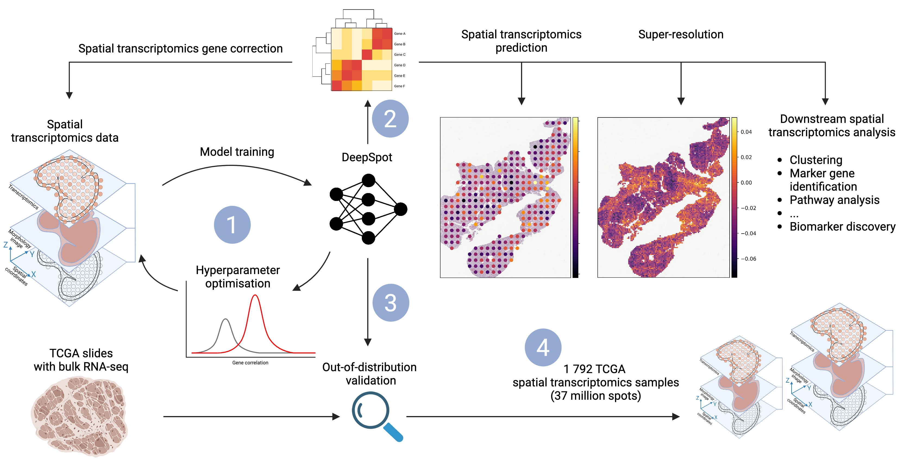

# DeepSpot: Leveraging Spatial Context for Enhanced Spatial Transcriptomics Prediction from H&E Images

This repository contains the code of the paper "DeepSpot: Leveraging Spatial Context for Enhanced Spatial Transcriptomics Prediction from H\&E Images".

**Authors**: Kalin Nonchev, Sebastian Dawo, Karina Selina, Holger Moch, Sonali Andani, Tumor Profiler Consortium, Viktor Hendrik Koelzer, and Gunnar Rätsch

The preprint is available [here](https://www.medrxiv.org/content/10.1101/2025.02.09.25321567v1).

You can find the DeepSpot code and tutorial on how to use it [here](https://github.com/ratschlab/DeepSpot).

The following figure provides a high-level overview of the available implementation.

**Fig**: DeepSpot predicts spatial transcriptomics from H&E images by leveraging recent foundation models in pathology and spatial multi-level tissue context. 1: DeepSpot is trained to predict 5 000 genes, with hyperparameters optimized using cross-validation. 2: DeepSpot can be used for de novo spatial transcriptomics prediction or for correcting existing spatial transcriptomics data. 3: Validation involves nested leave-one-out patient cross-validation and out-of-distribution testing. We predicted spatial transcriptomics from TCGA slide images, aggregated the data into pseudo-bulk RNA profiles, and compared them with the available ground truth bulk RNA-seq. 4: DeepSpot generated 1 792 TCGA spatial transcriptomic samples with over 37 million spots from melanoma or kidney cancer patients, enriching the available spatial transcriptomics data for TCGA samples and providing valuable insights into the molecular landscapes of cancer tissues.

## Snakemake overview

We provide the Snakemake pipeline we used to generate our paper's results. In the [workflows folder](workflows), we share the code base used for producing the cluster assignments on each dataset. 
Briefly:
1) The dataset-specific preprocessing can be found [here](workflows/preprocess).
2) The model scripts can be found [here](workflows/models).
3) The evaluation scripts can be found [here](workflows/evaluate).


## How to start

### 1. Install the conda environment

We start by installing the conda environment required for the different rules.

```
conda env create -f=environment.yaml
```

### 2. Config files

In the [Snakemake_info.yaml](Snakemake_info.yaml) we specify the general rule requirements and resources. Please adjust based on your setup.

In each dataset folder, there should be an `config_dataset.yaml` file (e.g., [`10x_TuPro/config_dataset.yaml`](10x_TuPro/config_dataset.yaml)), where we specify the sample names along with dataset-specific information and the models to use. This file is used as input for the Snakemake pipeline. 

### 3. Data structuring and preprocessing

The datasets can be downloaded from:
1) HEST-1K COAD - https://github.com/mahmoodlab/HEST
2) HEST-1K SCCRCC - https://github.com/mahmoodlab/HEST
3) Kidney and Lung with TLS - https://zenodo.org/records/14620362
4) Tumor Profiler Metastatic melanoma - https://github.com/ratschlab/st-rep (soon)

The downloaded raw spatial transcriptomics data has a different structure so it has to be unified. We provide examples [here](workflows/preprocess) for the discussed datasets.

### Execute preprocessing pipeline

Navigate to one of the dataset folders:
  - COAD (HEST-1K COAD)
  - SCCRCC (HEST-1K SCCRCC)
  - USZ (Kidney and Lung with TLS)
  - 10x_TuPro (Tumor Profiler)

Within the folder execute the following command in the terminal:

```
conda activate he2st
snakemake -s ../Snakefile.preprocess -k --use-conda --rerun-incomplete --rerun-triggers mtime --cluster "sbatch --mem={resources.mem_mb} --cpus-per-task={threads} -t {resources.time} --gres={resources.gpu} -p {resources.p} -o {resources.log} -J {resources.jobname} --tmp {resources.tmp}" -j 50
```

### 4. Execute evaluation pipeline

Within the folder execute the following command in the terminal:

```python
conda activate he2st
snakemake -s ../Snakefile.evaluate -k --use-conda --rerun-incomplete --rerun-triggers mtime --cluster "sbatch --mem={resources.mem_mb} --cpus-per-task={threads} -t {resources.time} --gres={resources.gpu} -p {resources.p} -o {resources.log} -J {resources.jobname} --tmp {resources.tmp}" -j 50
```

The trained model weights can be found at https://zenodo.org/records/14619853.

### 5. Spatial transcriptomic gene correction 

Within the folder execute the following command in the terminal:

```python
conda activate he2st
snakemake -s ../Snakefile.prediction -k --use-conda --rerun-incomplete --rerun-triggers mtime --cluster "sbatch --mem={resources.mem_mb} --cpus-per-task={threads} -t {resources.time} --gres={resources.gpu} -p {resources.p} -o {resources.log} -J {resources.jobname} --tmp {resources.tmp}" -j 50
```

### 6. TCGA inference

After training the models, we applied them to the data downloaded from TCGA (https://www.cancer.gov/ccg/research/genome-sequencing/tcga). We obtained FF and FFPE image slides and bulk RNA-seq data for the TCGA SKCM cohort (n=472 FF; n=276 FFPE) and the TCGA KIRC cohort (n=528 FF, n=516 FFPE). Next, we matched the slide images to the corresponding bulk RNA expression data, as detailed in the metadata_ff.ipynb and metadata_ffpe.ipynb for TCGA_KIRC and TCGA_SKCM. Once the data was unified, we executed the following command in the terminal from the specific TCGA folder:

```python
conda activate he2st
snakemake -s ../Snakefile.annotate -k --use-conda --rerun-incomplete --rerun-triggers mtime --cluster "sbatch --mem={resources.mem_mb} --cpus-per-task={threads} -t {resources.time} --gres={resources.gpu} -p {resources.p} -o {resources.log} -J {resources.jobname} --tmp {resources.tmp}" -j 50
```

The predicted spatial transcriptomics data from DeepSpot can be found at https://github.com/ratschlab/DeepSpot.

#### NB: To distinguish in-tissue spots from the background, tiles with a mean RGB value above 200 (near white) were discarded. Additional preprocessing can remove potential image artifacts.

## Ablation study

For the ablation study, we specify the fixed hyperparameters for each model [here](workflows/configs) and then we create `config_dataset.yaml` file with the model and the fixed hyperparameter value (e.g., [`10x_TuPro/config_dataset.yaml`](10x_TuPro/config_dataset.yaml)).

## Pathology foundation models

Please ensure that you download the weights for the pathology foundation models and update their file path in this [script](src/morphology_model.py).You may need to agree to specific terms and conditions before downloading.

#### NB: Computational data analysis was performed at Leonhard Med (https://sis.id.ethz.ch/services/sensitiveresearchdata/) secure trusted research environment at ETH Zurich. Our pipeline aligns with the specific cluster requirements and resources.

## Citation

In case you found our work useful, please consider citing us:

```
@article{nonchev2025deepspot,
  title={DeepSpot: Leveraging Spatial Context for Enhanced Spatial Transcriptomics Prediction from H\&E Images},
  author={Nonchev, Kalin and Dawo, Sebastian and Silina, Karina and Moch, Holger and Andani, Sonali and Tumor Profiler Consortium and Koelzer, Viktor H and Raetsch, Gunnar},
  journal={medRxiv},
  pages={2025--02},
  year={2025},
  publisher={Cold Spring Harbor Laboratory Press}
}
```

The code for reproducing the paper results can be found [here](https://github.com/ratschlab/st-rep).

## Contact

In case, you have questions, please get in touch with [Kalin Nonchev](https://bmi.inf.ethz.ch/people/person/kalin-nonchev).
